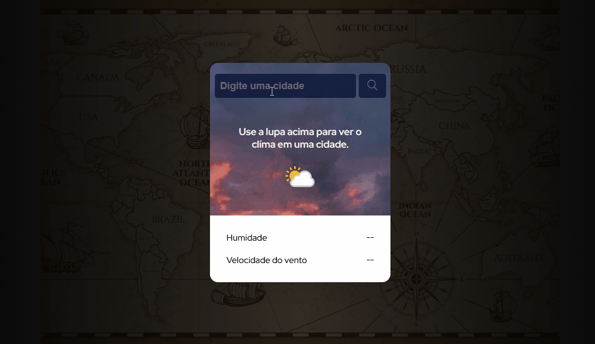
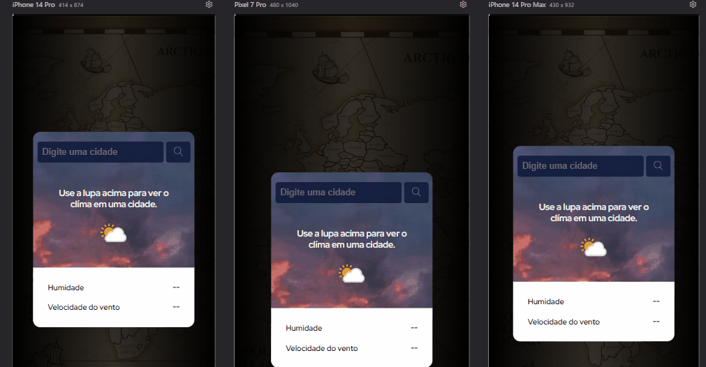

# Projeto App previsão do tempo.

## Descrição 📝
Projeto perfeito para testar conhecimento em JS e API. Este foi meu primeiro projeto utilizando javascript, O desafio é criar este aplicativo de previsão de Tempo mundial em tempo real usando a Weather API.  

Os usuários devem ser capazes de:

- Ver o layout ideal da página, independente do aparelho que estive usando, sendo responsivo.

- Gerar uma nova previsão clicando no ícone na lupa.

- Visualizar um a previsão do tempo de qualquer cidade, estado ou país, recebendo as informações contidas no APP. 

💻- Imagem do projeto em desktop.

[]

📱- Visualização projeto em mobile.

[
]

## Meus desafios no processo. 🤯
A realização do projeto foi um pouco difícil, principalmente por ser minha primeira vez utilizando lógoca de programação, mas foi incrível, ver O projeto tomando forma me deixou ansioso pelo resultado final.

O API está trabalhando bem, conferi os resultados da pesquisa de tempo do projeto com outros sites de tempo na internet.

Aqui também decidi me desafiar um pouco, quis mudar um pouco do projeto original, com um fundo branco que alterei, coloquei um Mapa Mundi de wallpaper dando efeito de profundidade, trazendo um design bonito e mantendo estrutudado, estou estudando constantemente para melhorar minhas habilidades.     

Ansioso para realizar projetos próprios meus, seguindo esse estilo, e criar sites criativos e de qualidade, ultrapassando a expectativa dos meus clientes. 

Grato!😊

## Como Utilizar. 👨‍💻

Clone com o projeto:
```
git clone https://github.com/HenryRomao/PROJ.APP-PREVISAO-DO-TEMPO.git
```

Acesse a pasta do projeto:
```
cd PROJ. APP-PREVISAO-DO-TEMPO
```

Bom estudo. 🍀

## Tecnologias utilizadas. 
- HTML
- CSS